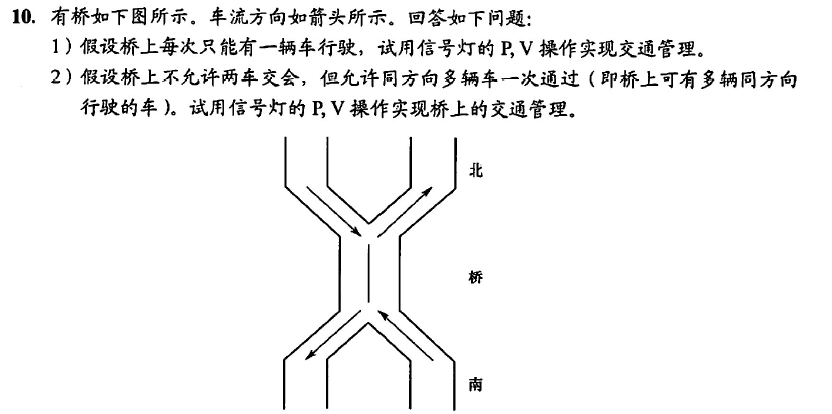

```
1、
semaphore bridge = 1;
North(){
    while(1){
        P(bridge);
        过桥;
        V(bridge);
    }
}
South(){
    while(1){
        P(bridge);
        过桥;
        V(bridge);
    }
}
2、
//类似多个读者同时读
semaphore mutex1 = 1, mutex2 = 2;//North,South
int countNorth = 0, countSouth = 0;
semaphore bridge = 1;
North(){
    while(1){
        P(mutex1);
        countNorth++;
        if(countNorth == 1){
            P(bridge);
        }
        V(mutex1);

        过桥;

        P(mutex1);
        countNorth--;
        if(countNorth == 0){
            V(bridge);
        }
        V(mutex1);
    }
}
South(){
    while(1){
        P(mutex2);
        countSouth++;
        if(countSouth == 1){
            P(bridge);
        }
        V(mutex2);

        过桥;

        P(mutex2);
        countSouth--;
        if(countSouth == 0){
            V(bridge);
        }
        V(mutex2);
    }
}

```
