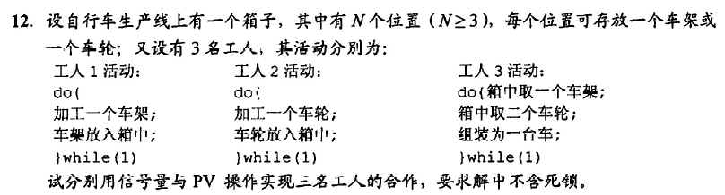

```
semaphore empty = N;
semaphore wheel = 0, frame = 0;
//为了防止死锁需要限制箱子中车轮和车架的最大值
semaphore maxWheel = N - 1;
semaphore maxFrame = N - 2;
worker1(){
    do{
        加工一个车架;
        P(maxFrame);
        P(empty);
        车架放入箱中;
        V(frame);
    }while(1);
}
worker2(){
    do{
        加工一个车轮;
        P(maxWheel);
        P(empty);
        车轮放入箱中;
        V(wheel);
    }while(1);
}
worker3(){
    do{
        P(frame);
        箱中取一个车架;
        V(empty);
        V(maxFrame);

        P(wheel);
        P(wheel);
        取出两个车轮;
        V(empty);
        V(empty);
        V(maxWheel);
        V(maxWheel);
        组装成一台车;
    }while(1);
}
```