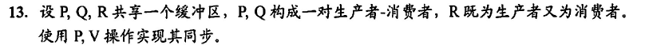

```
semaphore empty = 1;
semaphore full = 0;
semaphore mutex = 1;
P(){
    while(1){
        P(empty);
        P(mutex);
        产品放入缓冲区;
        V(mutex);
        V(full);
    }
}
Q(){
    while(1){
        P(full);
        P(mutex);
        从缓冲区取出产品;
        V(mutex);
        V(empty);
    }
}
R(){
    if(empty == 1){
        P(empty);
        P(mutex);
        产品放入缓冲区;
        V(mutex);
        V(full);
    }
    if(full == 1){
        P(full);
        P(mutex);
        从缓冲区取出产品;
        V(mutex);
        V(empty);
    }

}
```
