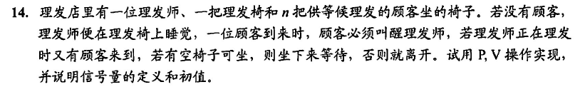

```
//理发师问题
int waiting = 0;//等候理发的顾客数
int chairs = n;//椅子数
semaphore consumers = 0;//等候理发的顾客数
semaphore barbers = 0;//等候顾客的理发师数,设置后可用来处理多理发师问题
semaphore mutex = 0;//互斥修改waiting变量
barber(){
    while(1){
        P(consumers);//若无顾客，睡觉

        P(mutex);
        waiting--;
        V(barbers);
        V(mutex);
        理发;

    }
}
customers(){
    while(1){
        P(mutex);
        if(waiting < chairs){
            waiting++;
            V(consumers);
            V(mutex);
            P(barbers);
            等待理发;
        }
        else{
            V(mutex);
        }
    }
}
```
