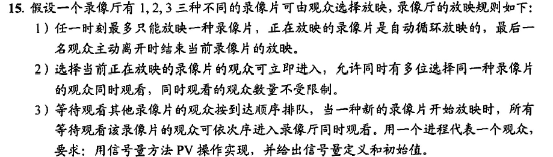

```
//类似读者写者问题
semaphore s = 0;//类似rw的作用，实现同步
semaphore s1 = 1,s2 = 1,s3 = 1;//互斥信号量
int count1 = 0,count2 = 0,count3 = 0;
audience_i(){//看第i部录像片的观众
    while(1){
        P(si);
        counti++;
        if(counti == 1){
            P(s);
        }
        V(si);
        看录像片;
        P(si);
        counti--;
        if(counti == 0){
            V(s);
        }
        V(si);
    }
}
```