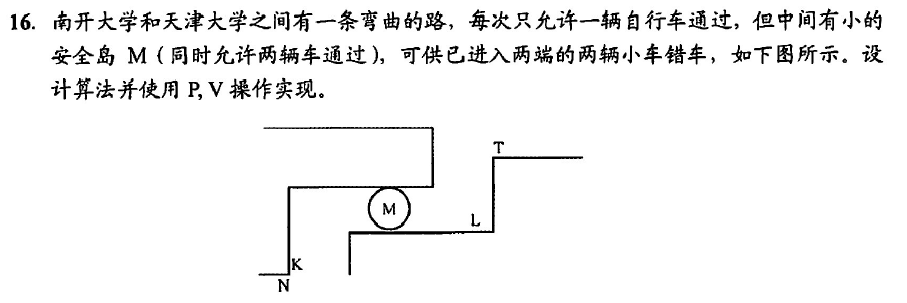

```

semaphore T2N = 1,N2T = 1;//互斥信号量
semaphore L = 1,K = 1;
T2N(){
    while(1){
        P(T2N);
        P(L);
        T到L;
        进入M;
        V(L);
        P(K);
        K到N;
        V(K);
        V(T2N);
    }
}
N2T(){
    while(1){
        P(N2T);
        P(K);
        N到K;
        进入M;
        V(K);
        P(L);
        L到T;
        V(L);
        V(N2T);
    }
}

```