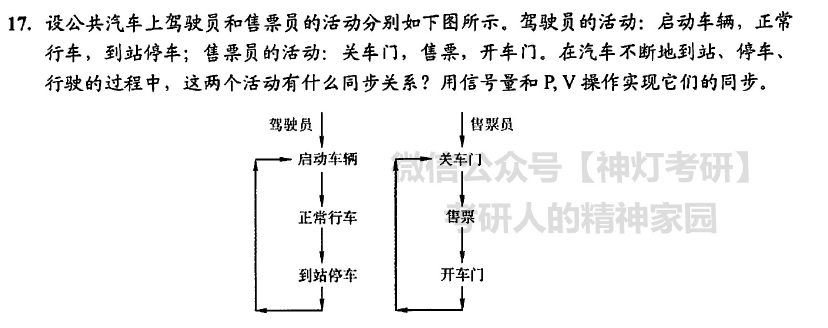

```
同步关系:
关车门->启动车辆
//正常行车->售票
到站停车->开车门
semaphore s1 = 0, s3 = 0;
driver(){
    while(1){
        P(s1);
        启动车辆;
        正常行车;
        到站停车;
        V(s3);
    }
}
seller(){
    while(1){
        关车门;
        V(s1);
        售票;
        P(s3);
        开车门;
        上下乘客;
    }
}
```