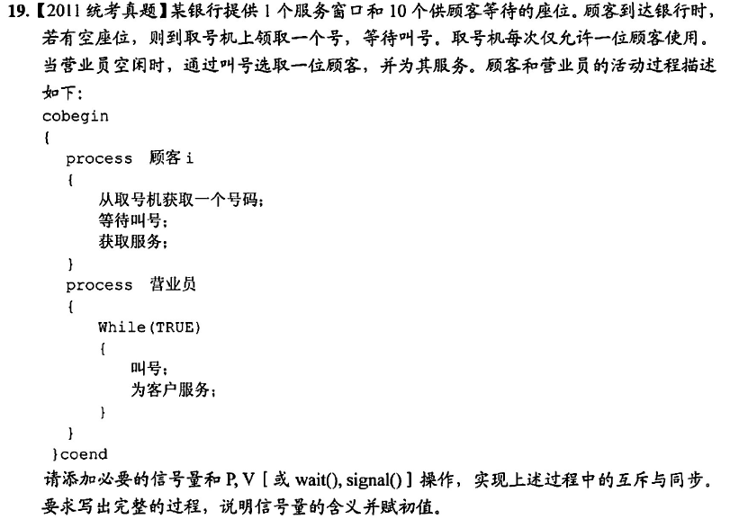

```
semaphore empty = 10;
semaphore full = 0;
semaphore mutex = 1;
semaphore service = 0;
process 顾客i{
    P(empty);
    P(mutex);
    从号码机获取一个号码;
    V(mutex);
    V(full);
    等待叫号;
    P(service);
    获取服务：
}
process 营业员{
    while(TRUE){
        P(full);
        //叫号;
        V(empty);
        V(service);//叫号
        为客户服务；
    }
}
```