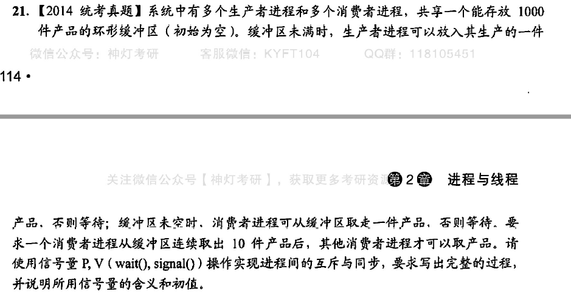

```
semaphore empty = 1000;
semaphore full = 0;
semaphore mutex = 1;//缓冲区互斥访问
semaphore mutex1 = 1;//控制消费者进程一个周期的访问
producer(){
    while(1){
        生产产品;
        P(empty);
        P(mutex);
        放入一件产品;
        V(mutex);
        V(full);
    }
}
consumer(){
    while(1){
        P(mutex1);
        for(int i = 0;i < 10;i++){
            P(full);
            P(mutex)
            取走产品;
            P(mutex);
            V(empty);
            消费;
        }
        V(mutex1);
    }
}
```