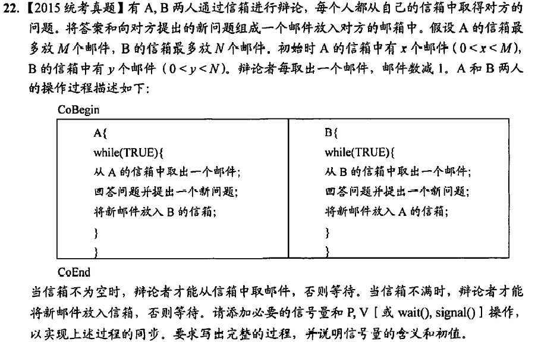

```
semaphore emptyA = M - x,fullA = x;
semaphore emptyB = N - y,fullB = y;
semaphore mutexA = 1;
semaphore mutexB = 1;
A{
    while(TRUE){
        P(fullA);
        P(mutexA);
        从A的信箱取出一个邮件;
        V(mutexA);
        V(emptyA);
        回答问题并提出一个新问题;
        P(emptyB);
        P(mutexB);
        将新邮件放入B的信箱;
        V(mutexB);
        V(fullB);
    }
}
B{
    while(TRUE){
        P(fullB);
        P(mutexB);
        从B的信箱取出一个邮件;
        V(mutexB);
        V(emptyB);
        回答问题并提出一个新问题;
        P(emptyA);
        P(mutexA);
        将新邮件放入A的信箱;
        V(mutexA);
        V(fullA);
    }
}
```