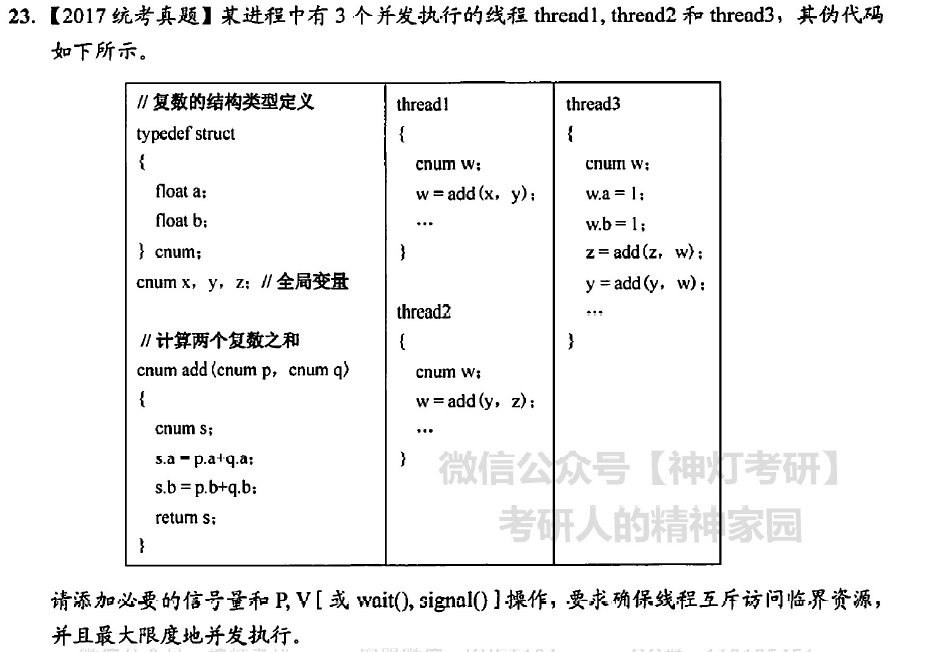

```
semaphore mutex_y1 = 1,mutex_y2 = 1,mutex_z = 1;
thread 1{
    enum w;
    P(mutex_y1);
    w = add(x,y);
    V(mutex_y1);
}
thread 2{
    enum w;
    P(mutex_y2);
    P(mutex_z);
    w = add(y,z);
    V(mutex_z);
    V(mutex_y2);
}
thread 3{
    enum w;
    w.a = 1;
    w.b = 1;
    P(mutex_z);
    w = add(z,w);
    V(mutex_z);

    P(mutex_y1);
    P(mutex_y2);
    w = add(y,w);
    V(mutex_y1);
    V(mutex_y2);
}
```