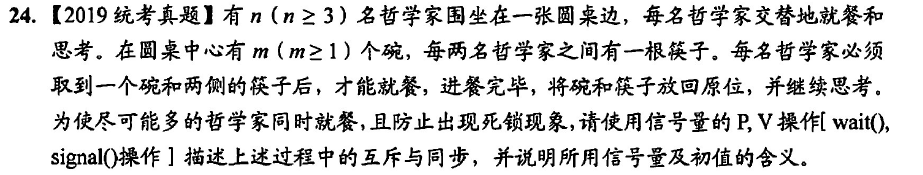

```
semaphore chopsticks[n];
for(int i = 0;i < n;i++){
    chopsticks[i] = 1;
}
semaphore bowl = min(m,n-1);
Pi(){
    while(1){
        思考;
        P(bowl);
        P(chopsticks[i]);
        P(chopsticks[(i+1) % n]);
        就餐;
        V(bowl);
        V(chopsticks[i]);
        V(chopsticks[(i+1) % n]);

    }
}
```