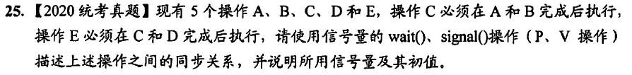

```
semaphore ac = 0,bc = 0;
semaphore ce = 0,de = 0;
A(){
    while(1){
        操作;
        V(ac);
    }
}
B(){
    while(1){
        操作;
        V(bc);
    }
}
C(){
    while(1){
        P(ac);
        P(bc);
        操作;
        V(ce);
    }
}
D(){
    while(1){
        操作;
        V(de);
    }
}
E(){
    while(1){
        P(ce);
        P(de);
        操作;
    }
}
```