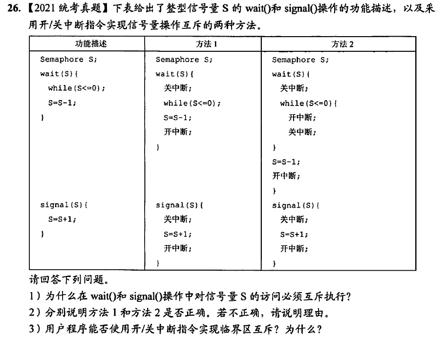

```
1、信号量S被多个进程共享，多个进程都可以通过wait()和signal()对S进行读写操作。所以必须互斥访问S
2、方法1错误，方法2正确。方法1在wait()中，当S<=0时关中断后其他进程无法修改S的值，while会陷入死循环。方法2中，在while循环中有开中断操作，允许其他进程对S进行修改，避免while陷入死循环。
3、不能。开/关中断指令必须在内核态执行，用户程序没有权限
```