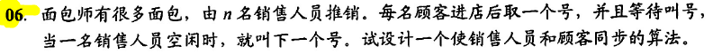

```
int i = 0, j = 0;//取号值，叫号值
semaphore mutex_i = 1, mutex_j = 1;//互斥访问修改i,j
consumer(){
    while(1){
        进店;
        P(mutex_i);
        取号i;
        i++;
        V(mutex_i);
        等待叫号i，购买面包;
    }
}
seller(){
    while(1){
        P(mutex_j);
        if(j < i){
            叫号j;
            j++;
            V(mutex_j);
            销售面包;
        }
        else{
            V(mutex_j);
            休息片刻;
        }
    }
}
```
