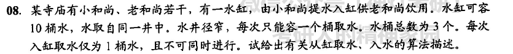

```
互斥关系：水井取水、水缸取水
同步关系：小和尚入水，老和尚取水；水桶三个
semaphore mutex1 = 1, mutex2 = 1;//分别对应水井、水缸
semaphore empty = 10, bucket = 3;//水缸可放10桶水，水桶有三个
semaphore full = 0 ###full2 = 0;
old(){
    while(1){
        P(full);
        P(bucket);
        P(mutex2);
        用桶从水缸取水;
        V(mutex2);
        V(empty);
        喝水
        V(bucket);
    }
}
young(){
    while(1){
        P(empty);//先执行，如果水缸满的就不去井里取水

        P(bucket);
        P(mutex1);
        用桶从水井取水;
        V(mutex1);

        
        P(mutex2);
        将桶里的水灌进水缸;
        V(mutex2);
        V(full);
        V(bucket);
    }
}
```

